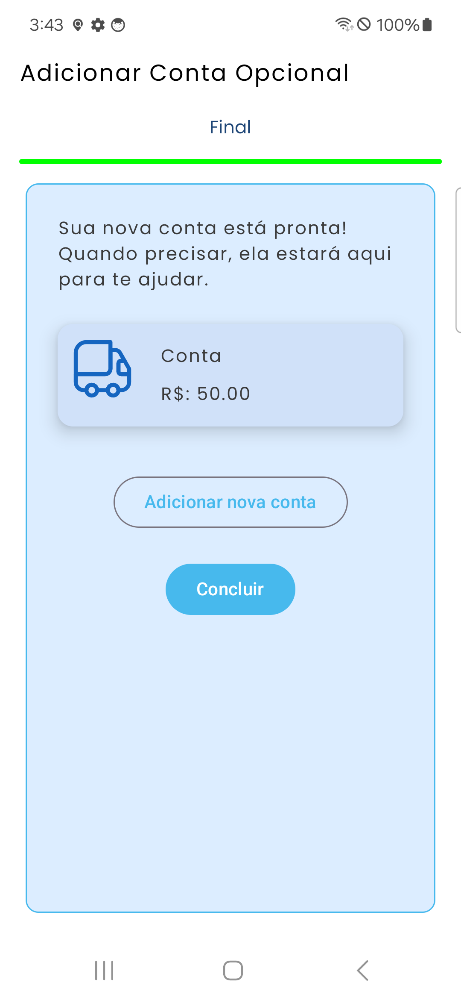

# Breeze

Breeze is a modern and visually appealing  financial organization app designed to provide a smooth  and intuitive  user experience. Built with Jetpack Compose, Breeze ensures fluid animations  and a seamless navigation experience.

## ✨ Features

-  **Visual Financial Overview** - Easily track and manage your accounts.
-  **Customizable UI** - Personalize your experience with vibrant icons  from the BreezeIcons library.
-  **Smooth Animations** - Designed with Lottie animations  for a dynamic interface.
-  **Data Persistence** - Uses Room Database  for local data storage.

## 🛠️ Technologies Used

-  [**Kotlin**](https://kotlinlang.org/docs/home.html)
-  [**Jetpack Compose**](https://developer.android.com/compose)
-  [**KSP**](https://kotlinlang.org/docs/ksp-overview.html)
-  [**Hilt for Dependency Injection**](https://developer.android.com/training/dependency-injection/hilt-android?hl=pt-br)
-  [**Room Database**](https://developer.android.com/jetpack/androidx/releases/room?hl=pt-br)
-  [**Breeze-Icons**](https://github.com/MiguelDK17/Breeze-Icons)
-  [**Lottie for animations**](https://github.com/airbnb/lottie-android)

## 📥 Installation

Currently, Breeze is under development  and not yet available for public installation. Stay tuned  for updates!

## 🖼️ Screenshots

## 🤝 Contribution
As of now, Breeze is in its early stages  of development and not open for contributions. However, feedback  and suggestions  are always welcome!

## 📜 License
Breeze is licensed under the MIT License. See [LICENSE](https://github.com/MiguelDK17/Breeze/blob/master/LICENSE) for more details.

---

Stay updated by following our progress! 🚀✨
